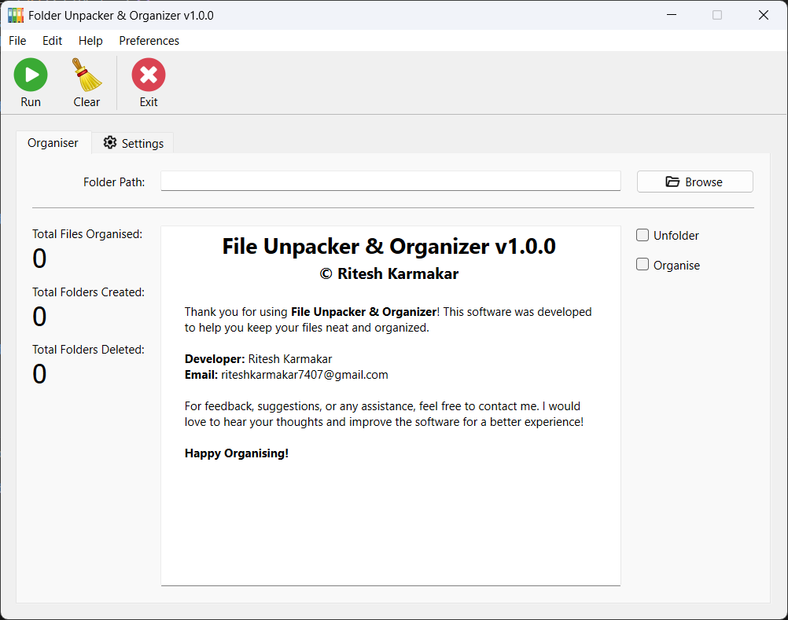
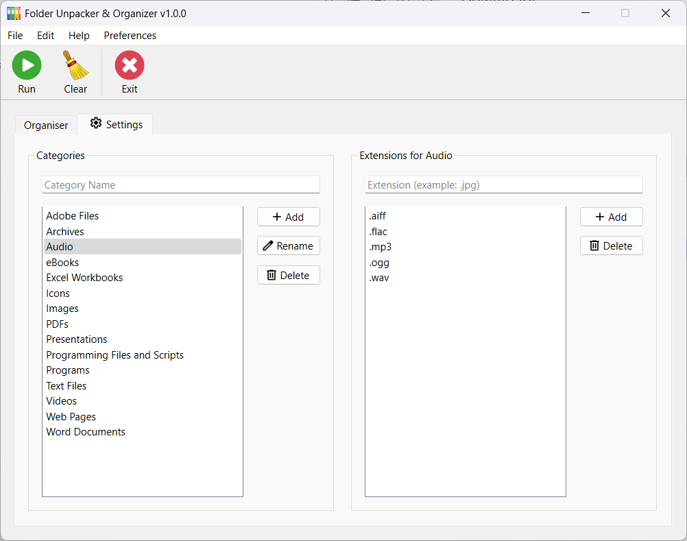

  <h1>Folder Unpacker & Organizer</h1>

  

    <b> Folder Unpacker & Organizer</b> is a user-friendly desktop application designed to help you keep your files neat and organized. It allows you to extract files from folders, organize them into predefined categories, and manage file extensions associated with each category.
  

  <picture>
    
  </picture>

## Features

### File Operations:
- **Unfolder**: Extracts files from nested folders.
- **Organize**: Sorts files into predefined categories.
- **Statistics Display**:
  - Total files organized.
  - Total folders created.
  - Total folders deleted.

### Settings
- **Category Management**: Add, rename, or delete file categories.
- **Extension Management**: Assign or remove file extensions for each category.
- **Predefined Categories**: Includes common categories such as Audio, Images, PDFs, Videos, and more.

  <picture>
    
  </picture>

## Getting Started

### Download and Installation

1. Download the application from [GitHub Releases](https://github.com/riteshkarmakar/folder-unpacker-organizer/releases).
2. Install the application by following the on-screen instructions.
3. Launch the application to start organising!

### How to Use

1. **Set Folder Path**: Use the "Browse" button to select the folder you want to organize.
2. **Choose Operations**:
   - Check the "Unfolder" option to extract files from nested folders.
   - Check the "Organize" option to sort files into categories.
3. **Run the Program**: Click the green "Run" button to start the process.
4. **Clear or Exit**:
   - Click the broom icon to clear the current session.
   - Click the red "Exit" button to close the application.
5. **Customize Categories**: Switch to the "Settings" tab to manage categories and file extensions.

---

## Credits
- **Developer**: Ritesh Karmakar
- **External Libraries/Tools Used**:
  - [PyQt6](https://pypi.org/project/PyQt6/)
  - [requests](https://pypi.org/project/requests/)

## Feedback and Support
If you encounter any issues or have feature suggestions, please reach out via riteshkarmakar7407@gmail.com.

---

**Happy Organizing!**
